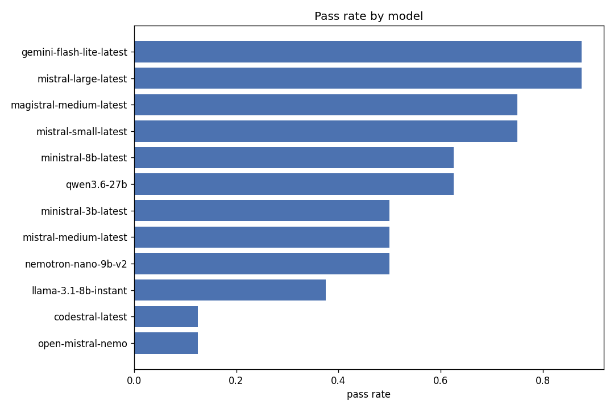
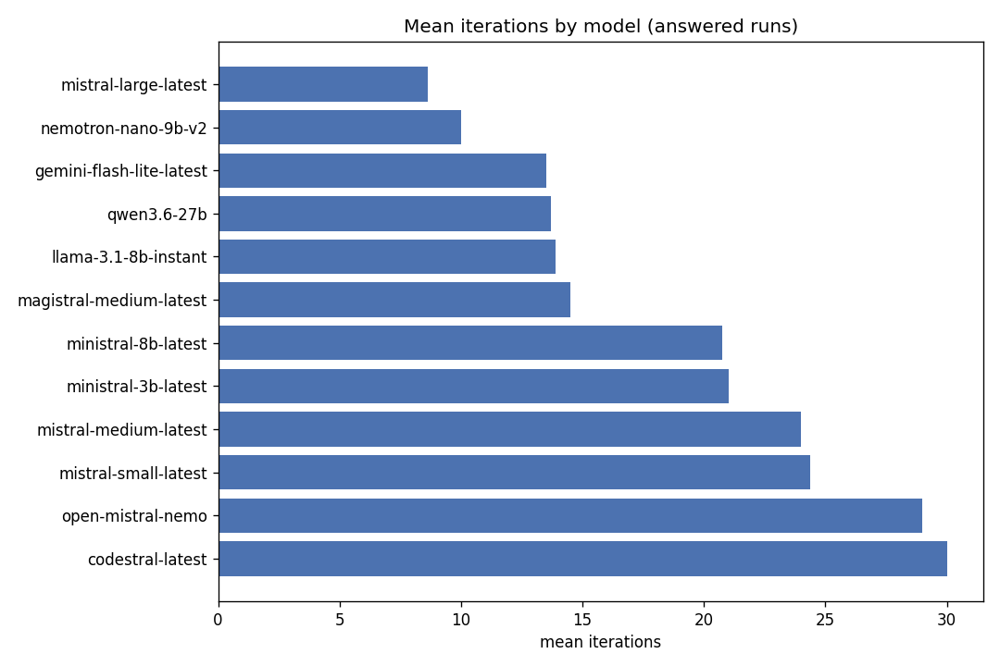
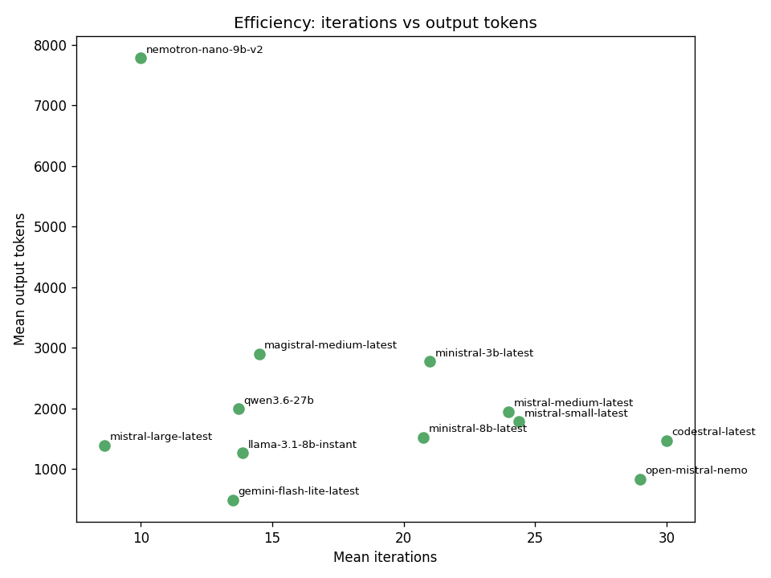

# Benchmark Report: Agent Smith on SWE-bench

This report measures the Agent Smith coding agent on real GitHub issues
from **SWE-bench Verified**. The agent configuration and tools are held
fixed and the language model behind the loop is swapped, so every number
below is a property of the model driving the same agent, not of a
different harness. All figures are regenerated from the evidence on disk
by `benchmarks/report.py` and `benchmarks/plots.py`. Nothing is
hand-edited.

## 1. Headline

- **18 models across four providers were pointed at the eight-task
  suite.** Twelve ran it end to end, solving **53 of 96 task instances
  (55%)**. Six were stopped by provider ceilings or protocol
  mismatches before the agent could work (Section 6).
- **`mistral-large-latest` is the winner** with **7/8**, the fewest
  iterations (**8.6**) and the least input context (**42.9k
  tokens/task**) of any model above half marks. A second full pass of
  the suite reproduced the same 7/8, task for task.
- **Its only miss fell to no one.** `psf__requests-1142` defeated all
  twelve models (0/12), the one wall in the suite.
- **The best free model is a genuine surprise.**
  `gemini-flash-lite-latest` also reaches 7/8, at 1.6 times the
  iterations and 1.5 times the context of the winner, under a daily
  quota that a single suite nearly exhausts.
- **Failure is legible.** Passing runs cluster far below the
  30-iteration cap and failing runs sit on it. Iterations are a
  leading indicator of the outcome.

## 2. Methodology

**Dataset.** Eight instances from SWE-bench Verified (`test` split), each
a real issue with a hidden test that decides pass/fail:

| Instance | Repository |
|---|---|
| `django__django-11066` | django/django |
| `pydata__xarray-4629` | pydata/xarray |
| `scikit-learn__scikit-learn-13439` | scikit-learn |
| `sympy__sympy-13480` | sympy/sympy |
| `sympy__sympy-18189` | sympy/sympy |
| `psf__requests-1142` | psf/requests |
| `sympy__sympy-21847` | sympy/sympy |
| `pydata__xarray-4356` | pydata/xarray |

The first five are the public seed set shipped with the evaluator. The
last three were added to widen repository and difficulty coverage.

**Agent.** For each (model, task) the agent runs the standard
Thought → Code → Observation loop against a Docker container built from
the task's evaluation image, capped at **30 iterations**. A run is a
**pass** only when the produced patch makes the hidden test suite go
green under the official validator. The shipped agent couples
context-aware search, exact-region feedback on failed edits, and a
verification gate that refuses to hand out an untested patch
(Section 8 ablates these pieces).

**Metrics.** `pass` (hidden tests green), `iterations` (loop steps),
`total_input_tokens` and `total_output_tokens` (billed context and
generation), `total_time_seconds` (wall clock), plus two derived
signals. **First touch** is the step at which the agent first reads a
file that appears in the final patch, a measure of exploration
efficiency. **Test gap** is the mean number of steps between two test
runs, a measure of iteration discipline.

**How to reproduce.** See Section 10.

## 3. Model comparison

Mean over the eight tasks, ordered by pass rate then by input cost. The
table holds the **twelve models that ran the full suite**. Six more
were stopped at the provider or protocol layer and are accounted for in
Section 6, where their near-empty rows belong.

| Model | Provider | Pass | Iters | In tok | Out tok | Time (s) |
|---|---|---|---|---|---|---|
| `mistral-large-latest` | Mistral | **7/8** | 8.6 | 42 933 | 1 391 | 58 |
| `gemini-flash-lite-latest` | Gemini | **7/8** | 13.5 | 66 095 | 493 | 41 |
| `magistral-medium-latest` | Mistral | 6/8 | 14.5 | 71 396 | 2 901 | 130 |
| `mistral-small-latest` | Mistral | 6/8 | 24.4 | 127 475 | 1 780 | 60 |
| `qwen3.6-27b` | Groq | 5/8 | 12.0 | 46 712 | 1 743 | 194 |
| `ministral-8b-latest` | Mistral | 5/8 | 20.8 | 80 229 | 1 522 | 60 |
| `nemotron-nano-9b-v2` | OpenRouter | 4/8 | 10.0 | 28 179 | 7 779 | 260 |
| `ministral-3b-latest` | Mistral | 4/8 | 21.0 | 92 602 | 2 775 | 53 |
| `mistral-medium-latest` | Mistral | 4/8 | 24.0 | 105 706 | 1 949 | 66 |
| `llama-3.1-8b-instant` | Groq | 3/8 | 13.9 | 39 841 | 1 266 | 197 |
| `codestral-latest` | Mistral | 1/8 | 30.0 | 79 260 | 1 464 | 25 |
| `open-mistral-nemo` | Mistral | 1/8 | 29.0 | 163 077 | 832 | 66 |





Three patterns stand out. First, capability and cost are not the same
axis: `mistral-large` wins on accuracy while spending a third of the
context of `mistral-small`, which loops three times longer for one
pass less. Second, the two 7/8 models get there differently. The
winner converges in 8.6 iterations on a paid endpoint, while the free
`gemini-flash-lite` needs 13.5 and lives one quota away from a dead
suite. Third, a **coding-specialised** name is no guarantee:
`codestral` (1/8, nearly every run at the cap) is beaten by the
general `mistral-large`, by `ministral-8b`, and even by the 9B
`nemotron-nano`.

## 4. Task difficulty

Solve count across the twelve full-suite models, with the mean
iterations each task demanded:

| Task | Solved | Mean iters |
|---|---|---|
| `sympy-13480` | 11/12 | 11.6 |
| `xarray-4629` | 9/12 | 16.3 |
| `sympy-18189` | 7/12 | 15.2 |
| `django-11066` | 7/12 | 18.4 |
| `sympy-21847` | 7/12 | 16.0 |
| `scikit-13439` | 6/12 | 20.9 |
| `xarray-4356` | 6/12 | 21.8 |
| `requests-1142` | **0/12** | 27.5 |

Difficulty and effort move together: the tasks fewer models solve are
exactly the ones that cost more iterations, from `sympy-13480` (11/12,
11.6 iters) down to `requests-1142` (0/12, 27.5, where most runs simply
hit the cap). The wall task asks for a subtle *restructuring*, removing
a default header and re-adding it conditionally, and every model,
winner included, keeps adding conditions without removing the default.
A suite with an unsolved task is also a useful property: the benchmark
has headroom left, and 55% overall is a measurement, not a ceiling
effect.

## 5. Efficiency: iterations vs cost



The efficient corner of low iterations and modest output belongs to
`mistral-large`. `magistral-medium` buys its 6/8 with reasoning weight
(2.9k output tokens/task, twice the winner's wall clock).
`nemotron-nano` shows the opposite failure of proportion: only 10
iterations on average but **7.8k output tokens/task**. It narrates
enormously and converts little. The **cap-bound** models (`codestral`,
`open-mistral-nemo`, and `mistral-small` on its failures) sit at the
right edge at 30 iterations, spending much and converting nothing.

## 6. Provider reliability and availability

Accuracy assumes the model answered. Many did not on the first try, and
six never produced a usable suite. The reliability view comes straight
from the request trace (`benchmarks/report.py`, *Provider
reliability*).

**Retries tell the story.** Paid Mistral endpoints answer with almost
no back-off. Gemini's flash-lite behaved like a paid endpoint right up
to its quota. Groq's free tier completes only after heavy rate-limit
retrying:

| Model | Requests | Retries | Avg response (s) | Answered |
|---|---|---|---|---|
| `mistral-small-latest` (Mistral) | 195 | 0 | 0.88 | 8/8 |
| `ministral-8b-latest` (Mistral) | 166 | 0 | 1.19 | 8/8 |
| `gemini-flash-lite-latest` (Gemini free) | 111 | 3 | 0.81 | 8/8 |
| `mistral-large-latest` (Mistral) | 102 | 33 | 3.81 | 8/8 |
| `nemotron-nano-9b-v2` (OpenRouter free) | 87 | 7 | 24.61 | 8/8 |
| `qwen3.6-27b` (Groq free) | 605 | **509** | 13.92 | 7/8 |
| `llama-3.1-8b-instant` (Groq free) | 662 | **551** | 12.64 | 8/8 |

A free model that answers can carry more retries than real requests
and an order of magnitude worse latency. In a throughput-bound setting
that difference dominates the token price.

**Six models never produced a usable suite.** They are kept here
because *why* they failed is itself a result:

- **Gemini daily quotas end suites mid-flight.**
  `gemini-3-flash-preview` made three real attempts and then returned
  `429 "exceeded your current quota"` for every remaining task.
  `gemini-flash-latest` managed one. A single SWE suite sits right at
  the edge of a free Gemini day, and `flash-lite` finished only by
  rotating across several API keys.
- **OpenRouter's free tier caps requests per day** (about 50 on a
  creditless account). One suite consumes 80 to 100 requests, so
  completing `nemotron-nano` also required spreading the load across
  accounts.
- **Groq's per-minute token ceiling** (about 12k) rejects a single SWE
  step with full repository context, so `llama-3.3-70b-versatile`
  answers only the three smallest-context tasks (passing one) and dies
  with `429` on the rest. A per-minute limit cannot be lifted by extra
  keys.
- **Groq `gpt-oss` tool protocol.** `gpt-oss-20b` and `gpt-oss-120b`
  return `400 "Tool choice is none, but model called a tool"`. The
  model insists on native tool-calling and never emits the code block
  the loop's contract requires. `gpt-oss-20b` produced zero usable
  runs, while `gpt-oss-120b` got three through and even solved
  `sympy-13480` before the protocol error killed the rest. The
  capability is visibly present and the transport is incompatible.
- **Devstral reply format.** `devstral-medium` answers every request
  (8/8 runs, about 80k tokens each) but never once emits the fenced
  code block the contract requires. Every reply is a bare sentence of
  intent ("I'll help you fix this issue...") from a model tuned for
  native tool-calling harnesses. Thirty NO_CODE feedback rounds per
  task change nothing: billed like a participant, incompatible like a
  bystander.

## 7. Intermediary metrics

Pass/fail is the outcome. The step trace shows *how* it was reached,
through two signals derived per run (`benchmarks/report.py`,
*Intermediary metrics*):

- **First touch**: the step at which the agent first reads a file that
  ends up in the patch. Low means it localised the bug quickly instead
  of wandering the repository.
- **Test gap**: the mean number of steps between two test runs. Low
  means it checks its work often instead of editing blind.

The winner illustrates the healthy profile. `mistral-large` records
**first touch = 1 on all seven passing tasks**, meaning the
context-aware search puts the right file in view on the opening step,
and a test gap of 1.0 to 3.7 where more than one test run was needed.
The cap-bound models show the opposite, a late or absent first touch
and long stretches of editing between tests, which is what running to
30 iterations looks like from the inside.

## 8. Agent-configuration ablation

The shipped configuration was reached by testing one change at a time
against a fixed pool, keeping only what survived repeated runs. Each
kept piece closes a failure mode observed in the step traces. Each
rejected one looked good in a small sample and degraded a larger one.

**Kept** (each validated on a 30-to-60-run pool):

| Piece | Failure mode it closes |
|---|---|
| Context-aware search (`around`) | wandering localisation, wrong-file edits |
| Exact-region feedback on failed edits | blind retry loops on mismatched `old_str` |
| Head+tail observation truncation | test verdicts hidden by head-only cuts |
| Verification gate on `get_patch` | patches submitted without running tests |
| "Submit once tests pass" rule | 5 to 7 wasted iterations after a green run |

**Rejected** (a sample of the levers that did not survive):

| Variant | Small-sample result | Larger-sample result |
|---|---|---|
| Wider history window (30 turns) | 29/30 pool | **52/60 seal, output blow-ups on easy tasks** |
| Batched-reconnaissance prompt | slower and messier edits | not pursued |
| Definition search with context | edits sent to the wrong file | not pursued |
| Early-submit prompt variants (×3) | faster | fast wrong submissions |

The systematic lesson, confirmed across nine rejected variants:
**reactive information helps and behavioural prescriptions backfire.**
Telling the model a fact at the moment it errs (the real file region,
the glob that cannot match) sticks. Telling it how to behave (submit
faster, batch lookups) trades reliability for speed. The shipped
configuration passed a 10-round stability seal of 57/60 task-runs with
no round losing more than one task, before this report's collection
was run with it.

## 9. Cost

Token counts are exact (Section 3). Dollar cost depends on each
provider's list price and is illustrative. For the winning
configuration, `mistral-large` at published list prices is on the order
of **$0.09 per task** (about 42.9k input plus 1.4k output tokens),
roughly **$0.75 for the full eight-task suite**. The free-tier models
cost $0 in tokens but pay elsewhere: hundreds of retries, 3 to 10
times the latency, daily quotas that a single suite can exhaust, and,
for six of the eighteen models, no usable suite at all. The runner-up
`gemini-flash-lite` shows the free tier at its best, and even it
needed several API keys to finish one suite. The cheapest *reliable*
way through the suite is the efficient paid model.

## 10. Reproducibility

- **Dataset**: SWE-bench Verified, `test` split, the eight instance IDs
  in Section 2. Evaluation images are the official
  `swebench/sweb.eval.*` containers, pulled automatically on first
  use.
- **Collect** (per provider, so each key resolves from `configs/models.json`):
  ```
  uv run python benchmarks/run.py --benchmark swebench \
      --tasks-dir benchmarks/tasks_swe \
      --models "<comma-separated ids>" \
      --provider-url "<base_url from models.json>" \
      --results-dir benchmarks/results
  ```
  Each run writes `benchmarks/results/<model>/<task>.solution.json`,
  which records the patch, every step, tokens, timings and retries.
- **Tables**: `uv run python benchmarks/report.py --results-dir benchmarks/results`
- **Figures**: `uv run --with matplotlib python benchmarks/plots.py --results-dir benchmarks/results --out-dir benchmarks/figures`
- **Keys** live only in `.env` (git-ignored). Comma-separated values in
  a key variable are rotated across requests.

## 11. Insights

1. **One model wins on every axis that matters.** `mistral-large` is
   the most accurate, the most context-frugal above half marks, its
   result held task for task under a full replication pass, and its
   single miss defeated all twelve models. Choosing the driving model
   matters more than any single prompt tweak.
2. **The best free model is one quota away from zero.**
   `gemini-flash-lite` matches the winner's pass count and needed
   several API keys to survive one suite, while its sibling previews
   died mid-suite on daily caps. Free accuracy exists. Free
   *reliability* does not.
3. **Iterations are a smoke alarm.** Both across models and across
   tasks, more looping predicts failure. A run drifting toward the cap
   is the signal to intervene, not to wait.
4. **Reliability is a first-class metric.** The agent piece that moved
   accuracy most was a *verification gate*, the fastest configurations
   were the ones rejected in ablation, and a third of the fleet was
   stopped by the provider layer before the model could think.
   Availability and consistency belong next to accuracy, not in a
   footnote.
5. **The provider layer is part of the system under test.** Tool
   protocols that refuse plain completions, reply formats tuned for
   other harnesses, per-minute token ceilings and daily request caps
   decided as many rows of this table as model quality did. A
   benchmark that ignores transport measures only half the system.

---

*Evidence: `benchmarks/results/` (one `solution.json` per run),
`benchmarks/figures/` (charts). Full model×task grid, provider
reliability and intermediary-metric tables: run `benchmarks/report.py`.*
